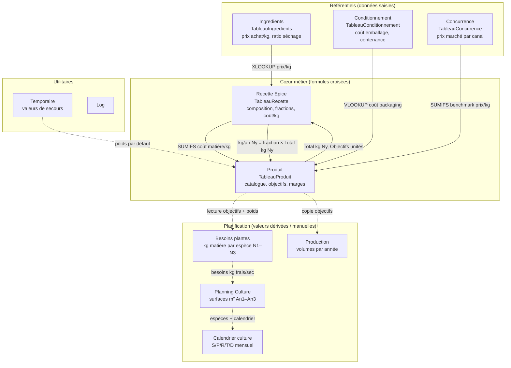

# Description du classeur (base v18)

Référence : **`Recettes et production - v18.xlsx`**

Ce classeur est le **modèle central de pilotage** du labo Le Chaudron qui Sent Bon. Il relie recettes, coûts matière, conditionnement, objectifs de vente, marges et besoins de culture.

---

## Vue d'ensemble

| Onglet | Table Excel | Lignes (v18) | Rôle principal |
|--------|-------------|:------------:|----------------|
| **Produit** | `TableauProduit` | 72 | Catalogue produits finis : prix, volumes N1–N9, marges |
| **Ingredients** | `TableauIngredients` | 172 | Référentiel matières : prix achat/kg, ratio séchage |
| **Recette Epice** | `TableauRecette` | 458 | Composition des recettes (1 ligne = 1 ingrédient) |
| **Conditionnement** | `TableauConditionnement` | 21 | Coûts et contenances des emballages |
| **Concurrence** | `TableauConcurence` | 186 | Benchmarks prix marché (BIO / non-BIO / artisan) |
| **Besoins plantes** | — | 80 | Besoins kg matière par espèce (dérivé des objectifs) |
| **Production** | `TableauProduction` | 220 | Synthèse volumes par produit et par année |
| **Planning Culture** | — | 36 | Surfaces à cultiver An1–An3 |
| **Calendrier culture** | — | 28 | Calendrier mensuel S/P/R/T/D par espèce |
| **Temporaire** | `Old` | 58 | Données de migration / valeurs de secours |
| **Log** | — | 1 | Journal de modifications (réservé) |

**71 recettes** uniques, **457 lignes ingrédients** dans `Recette Epice`.

---

## Diagramme des interactions entre onglets



**Légende :**
- Flèches pleines → liens **formules Excel** actifs dans v18
- Flèches pointillées → liens **logiques** (export manuel, recalcul script, ou lecture humaine)

---

## Détail par onglet

### 1. `Ingredients` — référentiel matières

**Clé :** nom d'ingrédient (colonne `Ingredients`)

| Colonne | Contenu |
|---------|---------|
| `Ingredients` | Nom unique (doit correspondre exactement à `Recette Epice`) |
| `Ratio séchage` | Facteur frais → sec (ex. 0,20 pour menthe) |
| `% eau` | Teneur en eau |
| `Nom de la Production` | Libellé culture / achat |
| `Prix de vente / kg` | Prix de revente éventuel |
| `Prix d'achat / kg` | **Coût matière** utilisé dans les recettes |
| `Lien` | URL fournisseur |

**Consommateur :** `Recette Epice` (colonne G via `XLOOKUP` sur `TableauIngredients`).

---

### 2. `Recette Epice` — composition des recettes

**Clé logique :** `Recette` + `Conditionnement` + `Ingredients`

| Colonne | Rôle | Formule type |
|---------|------|--------------|
| A `Recette` | Nom produit | saisie |
| B `ID` | Clé de liaison | `=Recette & Conditionnement` |
| C `Ingredients` | Matière | saisie (doit exister dans `Ingredients`) |
| D `Proportion` | Poids relatif dans le mélange | saisie |
| E `Conditionnement` | Format de vente | saisie (doit exister dans `Conditionnement`) |
| F `fraction mélange` | Part normalisée (0–1) | `Proportion / SUMIFS(...)` |
| G `Prix d'achat / kg` | Coût composant au kg mélange | `XLOOKUP(ingrédient) × fraction` |
| H `Total proportion` | Somme des proportions | `SUMIFS` par recette+conditionnement |
| I `Prix pour kg de mélange` | Coût ingrédient pondéré | `prix × proportion / total` |
| J `Pays` | Origine (optionnel) | saisie |
| K `Type` | SEC / en huile / sirop… | saisie |
| L–T `kg / année 1…9` | Besoin ingrédient par an | `fraction × Total (kg) Ny` depuis `Produit` |

> **Attention :** les noms internes de colonnes de `TableauRecette` diffèrent parfois des en-têtes affichés. Voir [[Analyse Recette Epice (base v18)]].

---

### 3. `Produit` — catalogue et pilotage commercial

**Clé :** `Recette` (1 ligne = 1 SKU : recette × conditionnement)

| Zone colonnes | Contenu |
|---------------|---------|
| A–E | Identité : recette, ID, ratio travail, poids/unité, conditionnement |
| F | `Packaging / unité` ← `VLOOKUP` sur `Conditionnement` |
| G | `Prix achat plantes / kg` ← `SUMIFS` sur `Recette Epice` |
| H–I | Prix de vente unitaire et au kg |
| J–L | Benchmarks concurrence (non-BIO, BIO, artisan) ← `Concurrence` |
| M+ | Objectifs N1–N9, puis pour chaque année : Total kg, coût conditionnement, achat plantes, revenu brut, **revenu net** |

**Formule centrale (marge matière) :**

```
Revenu net Ny = Revenu brut Ny − Achat plantes Ny − Conditionnement Ny
```

**Alimente :** `Recette Epice` (colonnes kg/an), `Besoins plantes`, `Production`.

---

### 4. `Conditionnement` — emballages

| Colonne | Contenu |
|---------|---------|
| `Nom` | Clé (ex. `Epice 100ml`, `Sirop 500 ml`) |
| `Bouchon`, `Verre`, `Total` | Coûts unitaires |
| `Contenance` | Volume / poids net |
| `Lien bouchon`, `Lien verre` | URLs achat |

**Consommateur :** `Produit` (colonne F et coût conditionnement Ny).

---

### 5. `Concurrence` — benchmarks marché

| Colonne | Contenu |
|---------|---------|
| `PRODUIT` | Nom recette (doit matcher `Produit`) |
| `DISTRIBUTION` | `magasin NON BIO` / `magasin BIO` / `artisanale BIO` |
| `NOM`, `MARQUE`, `GRAMMAGE`, `PRIX` | Détail offre concurrente |
| `PRIX_KG` | Prix normalisé au kg |

**Consommateur :** `Produit` (colonnes J–L, positionnement prix).

---

### 6. `Besoins plantes` — besoins matière

Onglet **sans formules croisées** dans v18 (valeurs calculées ou saisies).

**Logique :**

```
kg ingrédient Ny = objectifs unités Ny × poids/unité × fraction recette
kg frais ≈ kg sec × ratio séchage (depuis Ingredients)
```

Alimente la réflexion sur **Planning Culture** (surfaces à prévoir).

---

### 7. `Production` — synthèse volumes

Table `TableauProduction` : copie des objectifs par produit et par année (An1–An8+).

Pas de formules vers les autres onglets dans v18 — synchronisation manuelle ou script.

---

### 8. `Planning Culture` et `Calendrier culture`

Onglets de **planification agronomique** :

- **Planning Culture** : espèce, espace (maraîchage, tunnel, grande culture…), surfaces m² An1–An3
- **Calendrier culture** : grille mensuelle Semis / Plantation / Récolte / Taille / Diviser

Liés logiquement à `Besoins plantes`, pas par formules Excel dans v18.

---

### 9. `Temporaire` et `Log`

- **Temporaire** : table `Old` — poids par défaut, données de migration (utilisé ponctuellement par `Produit`)
- **Log** : réservé au suivi des modifications

---

## Flux de données principal (résumé)

```
1. Saisir / mettre à jour les ingrédients et leurs prix  →  Ingredients
2. Définir les emballages et coûts                      →  Conditionnement
3. Composer les recettes (proportions)                   →  Recette Epice
4. Créer le SKU dans le catalogue                        →  Produit
5. Fixer objectifs de vente N1–N9                        →  Produit
6. Vérifier marges, benchmarks                         →  Produit (auto)
7. Dériver besoins culture                               →  Besoins plantes → Planning Culture
```

---

## Clés de jointure

| De | Vers | Clé |
|----|------|-----|
| `Recette Epice` → `Ingredients` | nom exact `Ingredients` |
| `Recette Epice` → `Produit` | `ID` = `Recette & Conditionnement` |
| `Produit` → `Conditionnement` | nom `Conditionnement` |
| `Produit` → `Concurrence` | nom `Recette` = `PRODUIT` |
| `Produit` → `Recette Epice` | `Recette` + `Conditionnement` |

---

## Liens

- [[Analyse Recette Epice (base v18)]]
- [[Méthode de contribution Recette Epice]]
- [[0 - Charge de Travail & Objectifs de Production]]
- [[Planning Culture]]
- [[0 - Index Recettes d'épices]]
