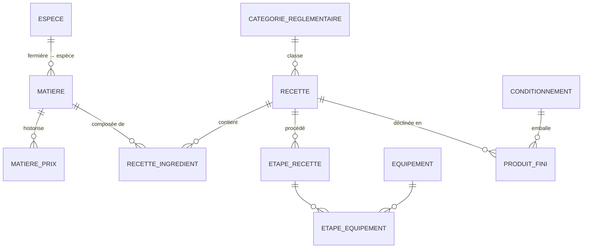

# Spec — Domaine A : Catalogue

Spec détaillée du **socle** de l'application (matières, recettes, conditionnements, produits finis). Découle de [[00 - Cas d'utilisation]] (UC-A*) et de [[10 - Décisions & questions ouvertes]] (D1–D18). Tous les autres domaines en dépendent.

> **Stack** : Hostinger Business, Node.js/Next.js ou Python, MySQL/MariaDB — voir [[Guide technique pour développeurs]]. **API REST**, **multi-utilisateur**, **webhooks configurables**.

---

## 1. Objet & périmètre

Gérer le catalogue : **matières** (3 provenances), **recettes** (ingrédients, étapes, coûts), **conditionnements**, **produits finis** (SKU) avec **coût de revient** et **marge**. Reprend les onglets `Ingredients`, `Recette Epice`, `Conditionnement`, `Produit` du classeur v19, avec l'intégrité garantie par l'app.

**Hors périmètre de cette spec** (traités ailleurs) : stock (domaine D), production/transformation (C), culture/espèces (E), ventes (B). Le Catalogue expose seulement les **FK** vers l'espèce (matière fermière).

---

## 2. Décisions de conception (Catalogue)

| # | Décision |
|---|----------|
| CA-1 | **Produit fini → toujours une Recette.** Une **revente de matière brute** (UC-A1.7) passe par une **recette « simple »** (mono-ingrédient, sans étape). `Recette.type ∈ {transformation, simple}`. |
| CA-2 | **Unités non pesables** : `poids_equiv_g` optionnel sur la ligne d'ingrédient. Absent ⇒ ligne sans coût et recette marquée **`cout_partiel`** (estimatif). |
| CA-3 | **Main d'œuvre incluse par défaut** dans le prix de revient affiché ; détail (matière / conditionnement / MO) toujours consultable. Interrupteur global `inclure_mo` (D11). |
| CA-4 | **Historique de prix** matière : table `matiere_prix` `{date, prix}` ; le **dernier** prix = prix courant du calcul ; historique **exposé en API** (Q-A3). |
| CA-5 | **Archivage** (jamais de suppression dure) pour tout objet potentiellement référencé (matière, recette, conditionnement, produit). |

---

## 3. Modèle de données



### 3.1 Entités & champs

**Matiere**
- `id` (PK), `nom` (unique, requis), `nom_latin`
- `provenance` enum : `fermiere` 🟢 / `importation` 🟠 / `base` ⚪
- `unite_achat` enum : `kg` / `L` / `piece`
- `ratio_sechage` (frais→sec, ex. 0,35), `pct_eau`
- `besoin_eau` enum : `faible` / `modere` / `eleve` (qualitatif, cf. Excel)
- `source`, `fournisseur`, `lien` (URL)
- `prix_vente_kg` (nullable — revente brute, UC-A1.7)
- `espece_id` (FK **Espece**, nullable, requis si `provenance = fermiere`)
- `archivee` (bool), `created_at`, `updated_at`
- *Prix d'achat courant = dernier `MatierePrix` (cf. 3.2).*

**MatierePrix**
- `id`, `matiere_id` (FK), `date` (YYYY-MM-DD), `prix` (par `unite_achat`)

**Recette**
- `id`, `nom` (unique, requis), `description`, `tags` (liste)
- `famille` enum : `sec` / `sirop` / `sel` / `sucre` / `vinaigre` / `lacto` / `moutarde` / `tabasco` / `tisane` / `cosmetique` / … (extensible)
- `type` enum : `transformation` / `simple` (CA-1)
- `categorie_reglementaire_id` (FK, nullable)
- `mode_quantite` enum : `proportions` / `absolu`
- `quantite_sortie` (nombre) + `unite_sortie` (kg / L / …) — quantité produite par **lot de référence** (ex. 1 L de sirop, 10 kg de chou). Utilisée pour normaliser le coût en mode `absolu` et dériver le nb d'unités par lot.
- `lot_ref_libelle` (texte libre d'affichage, ex. « pour ~1 L »)
- `rendement_ratio_travail` (pertes frais→fini, défaut 1)
- `notes_variante` (texte — Q-A1), `archivee`, timestamps

**RecetteIngredient**
- `id`, `recette_id` (FK), `matiere_id` (FK), `ordre`
- `quantite` (nombre), `unite` (`part` / `g` / `kg` / `mL` / `L` / `piece` / …)
- `poids_equiv_g` (nullable — CA-2)

**EtapeRecette**
- `id`, `recette_id` (FK), `ordre`, `description`
- `temps_main_oeuvre` (min), `temps_attente` (min)
- `parametres_controle` (JSON : `{temperature?, duree?, ph_cible?, brix?, sel_pct?}`)

**Equipement** — `id`, `nom` (unique). **EtapeEquipement** — `(etape_id, equipement_id)` (m:n).

**CategorieReglementaire** — `id`, `nom` (unique), `lien_fiche` (vers [[0 - Cadre général]]).

**Conditionnement**
- `id`, `nom` (unique), `contenance`, `poids_net`
- `cout_contenant`, `cout_bouchon`, `cout_etiquette`, `cout_total` (saisi ou = somme)
- `lien_contenant`, `lien_bouchon`, `archive`

**ProduitFini**
- `id`, `recette_id` (FK, requis), `conditionnement_id` (FK, requis)
- `poids_unite` (kg net/unité), `prix_vente_unite`, `actif`
- *Nom d'affichage = `recette.nom` + `conditionnement.nom`.*
- *Prix de revient & marge = **calculés** (§6), non stockés (ou cache invalidé sur changement).*

**Parametres** (singleton) — `taux_horaire_main_oeuvre`, `inclure_mo` (bool, défaut `true`).

---

## 4. Écrans (back-office)

Menu latéral **Catalogue** → 5 entrées + référentiels.

- **Matières** — liste (filtre `provenance`, recherche, badge « sans prix »), fiche CRUD, **historique de prix** (ajout `{date, prix}`), **« où est utilisée »** (recettes/produits référençant). Archivage.
- **Recettes** — liste + fiche : ingrédients (matière + quantité + unité + `poids_equiv_g?`, mode proportions/absolu), étapes ordonnées (temps MO, temps attente, équipements, paramètres de contrôle), famille + catégorie réglementaire. Affiche **coût matière/kg**, **temps de travail**, badge **« coût partiel »**. Bouton **Dupliquer**.
- **Conditionnements** — CRUD, coûts, contenance, liens.
- **Produits finis** — CRUD (recette × conditionnement × poids/unité + prix de vente), **prix de revient décomposé** (matière + conditionnement + MO) et **marge** (unité, %, kg), actif/inactif. Raccourci **« créer une recette simple »** depuis une matière (revente brute).
- **Référentiels** — Équipements, Catégories réglementaires, **Paramètres** (taux horaire, `inclure_mo`).

Recherche globale (UC-T1) sur matières / recettes / produits.

---

## 5. API REST

Préfixe `/api`. JSON, pagination sur les listes, erreurs `{code, message, details}`. **Auth** : clé d'API (intégrations) + session login/mdp (utilisateurs).

| Ressource | Méthodes |
|---|---|
| `/matieres` | GET (filtre `provenance`), POST, GET/PUT `:id`, DELETE `:id` → archive |
| `/matieres/:id/prix` | GET (historique), POST (`{date, prix}`) |
| `/matieres/:id/usages` | GET (recettes/produits qui l'utilisent) |
| `/recettes` | GET, POST, GET/PUT `:id`, DELETE → archive, POST `:id/dupliquer` |
| `/recettes/:id/ingredients`, `/recettes/:id/etapes` | CRUD sous-ressources |
| `/recettes/:id/cout` | GET → `{cout_matiere_kg, cout_partiel, temps_mo}` |
| `/conditionnements` | CRUD (+ archive) |
| `/produits` | GET, POST, GET/PUT `:id` (dont `actif`) |
| `/produits/:id/revient` | GET → revient décomposé + marge |
| `/equipements`, `/categories-reglementaires`, `/parametres` | CRUD |

**Intégrité** : archiver/modifier un objet référencé de façon incohérente → **409** avec `details` (liste des références). Voir §7.

---

## 6. Règles de calcul

### 6.1 Coût matière d'une recette
- **Mode `proportions`** : `fractionᵢ = proportionᵢ / Σ proportions` → `cout_matiere_kg = Σ (fractionᵢ × prix_courantᵢ)`.
- **Mode `absolu`** : `cout_lot = Σ cout_ligneᵢ` avec `cout_ligneᵢ = quantitéᵢ (convertie en unite_achat de la matière) × prix_courantᵢ` → `cout_matiere_sortie = cout_lot / quantite_sortie`.
- **Conversion d'unités** par une couche dédiée (g↔kg, mL↔L ; `piece`/non pesable via `poids_equiv_g`).
- `cout_partiel = true` si ≥ 1 ligne sans coût dérivable (prix manquant **ou** `poids_equiv_g` absent pour une unité non pesable). Affichage **estimatif**.

### 6.2 Temps de travail
- `temps_mo_recette = Σ etapes.temps_main_oeuvre` (le `temps_attente` est tracé mais **non** compté comme MO).

### 6.3 Prix de revient d'un produit (par unité)
```
nb_unites_lot        = quantite_sortie ÷ poids_unite    (poids_unite converti vers unite_sortie)
temps_mo_unite       = temps_mo_recette ÷ nb_unites_lot
cout_matiere_unite   = cout_matiere_kg × poids_unite ÷ rendement_ratio_travail
cout_conditionnement = conditionnement.cout_total
cout_mo_unite        = temps_mo_unite × taux_horaire_main_oeuvre       (si inclure_mo)
prix_revient_unite   = cout_matiere_unite + cout_conditionnement + cout_mo_unite
```
`inclure_mo = true` par défaut (CA-3) ; le détail des 3 postes reste toujours affiché.

### 6.4 Marge
`marge_unite = prix_vente_unite − prix_revient_unite` · `marge_pct = marge_unite ÷ prix_vente_unite` · `marge_kg = marge_unite ÷ poids_unite`.

---

## 7. Invariants d'intégrité (UC-T7)

Garantis par l'app (remplacent les contrôles manuels de la [[Méthode de contribution Recette Epice]]) :
1. **Noms uniques** : matière, recette, conditionnement, produit.
2. **Références valides** : un `RecetteIngredient` pointe une matière existante ; un `ProduitFini` une recette + un conditionnement existants.
3. **Renommage propagé** automatiquement (liens par `id`, jamais par nom).
4. **Pas de suppression dure** d'un objet référencé → **archivage** ; tentative incohérente → **409** listant les références.
5. **Cohérence provenance** : `espece_id` requis ⇔ `provenance = fermiere`.

---

## 8. Webhooks émis (config JSON `nom.du.hook → [urls]`, D17)

| Événement | Déclencheur | Payload (clés) |
|---|---|---|
| `matiere.creee` / `matiere.maj` | création / modification | `id, nom, provenance, prix_courant` |
| `matiere.prix_ajoute` | nouveau prix | `matiere_id, date, prix` |
| `recette.creee` / `recette.maj` | | `id, nom, famille, cout_matiere_kg, cout_partiel` |
| `conditionnement.maj` | | `id, nom, cout_total` |
| `produit.cree` / `produit.maj` / `produit.desactive` | | `id, recette_id, conditionnement_id, prix_vente_unite, prix_revient_unite` |

Payloads **versionnés** (`version` + `type` + `data`) et **documentés** (déclencheur + schéma) dans la doc API/webhooks.

---

## 9. Hors périmètre V1 / questions ouvertes

- Benchmarks concurrence (Q-A2) — hors V1.
- Import initial depuis `Recettes et production - v19.xlsx` (UC-T3) — **souhaitable**, à cadrer dans une spec d'import dédiée.
- Familles **cosmétiques** : modèle générique prêt, données V1 = alimentaire (Q-A6).
- `❓` Seuil de **stock mini d'alerte** par matière (lien domaine D).
- `❓` Référentiel **fournisseurs** dédié (V1 = champ texte).

---

## Liens

- [[00 - Cas d'utilisation]] · [[10 - Décisions & questions ouvertes]] · [[Guide technique pour développeurs]]
- [[Description du classeur (base v18)]] · [[Méthode de contribution Recette Epice]]
